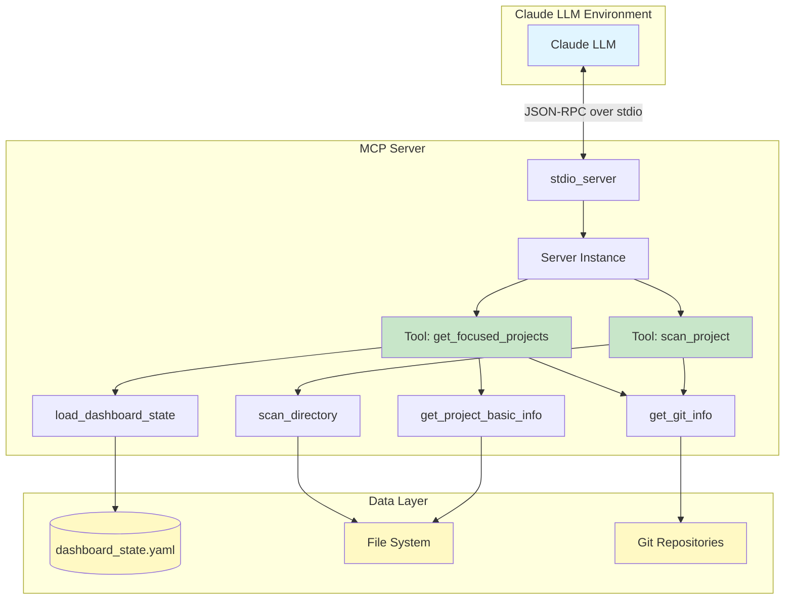
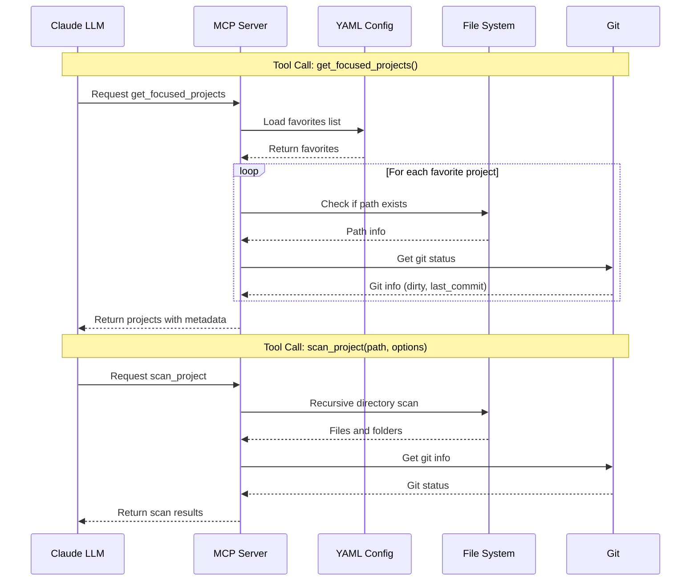
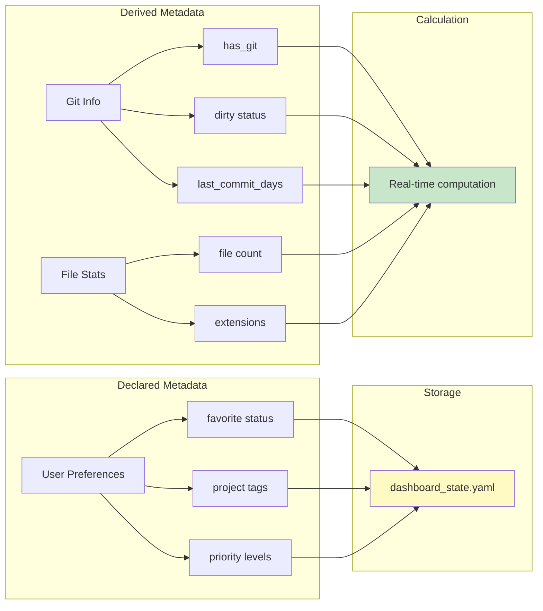
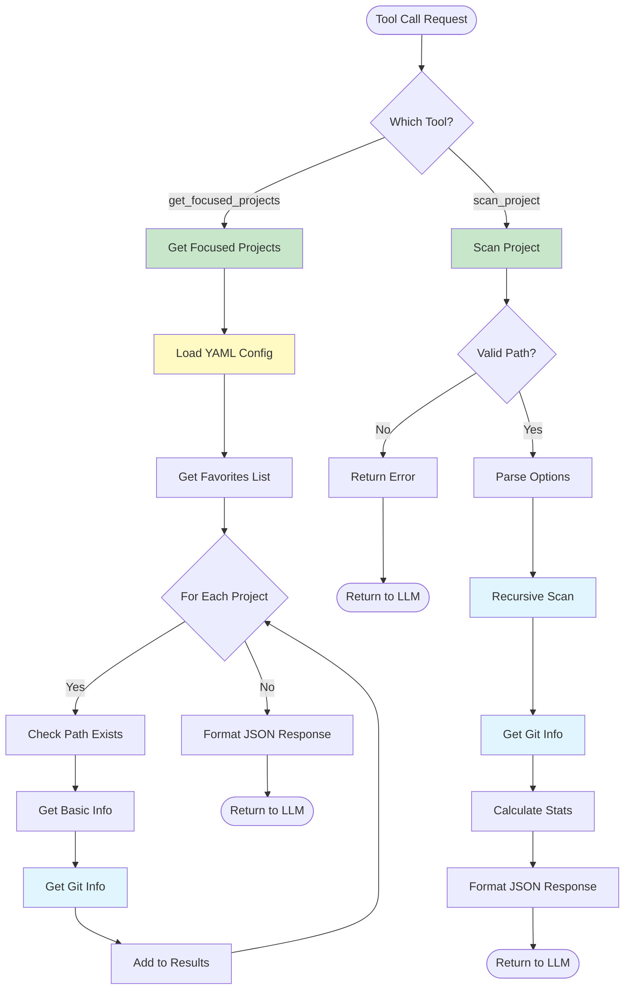
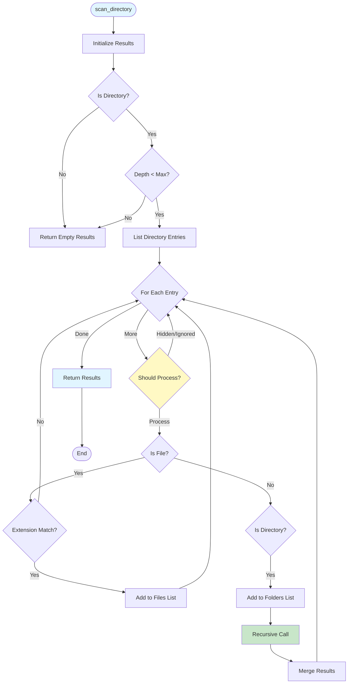
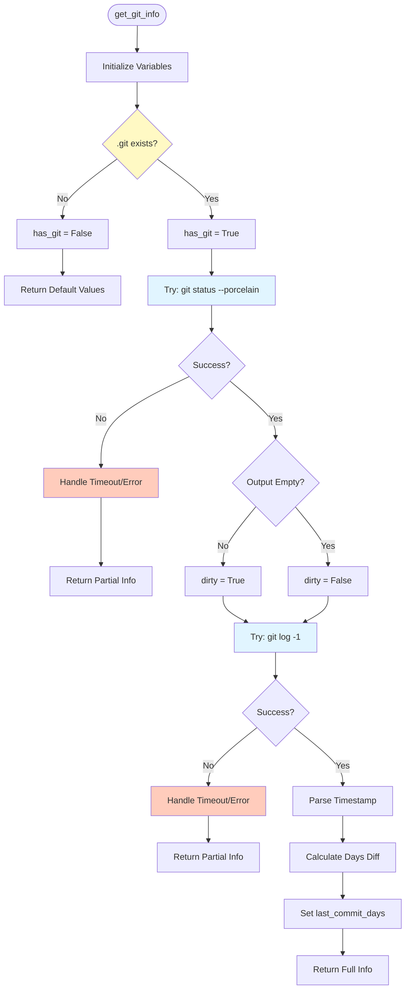
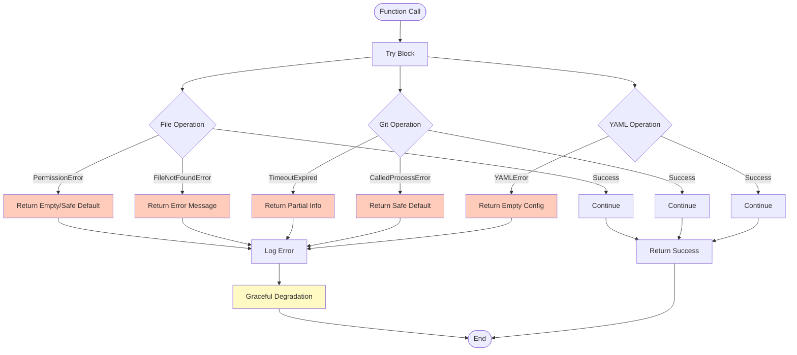
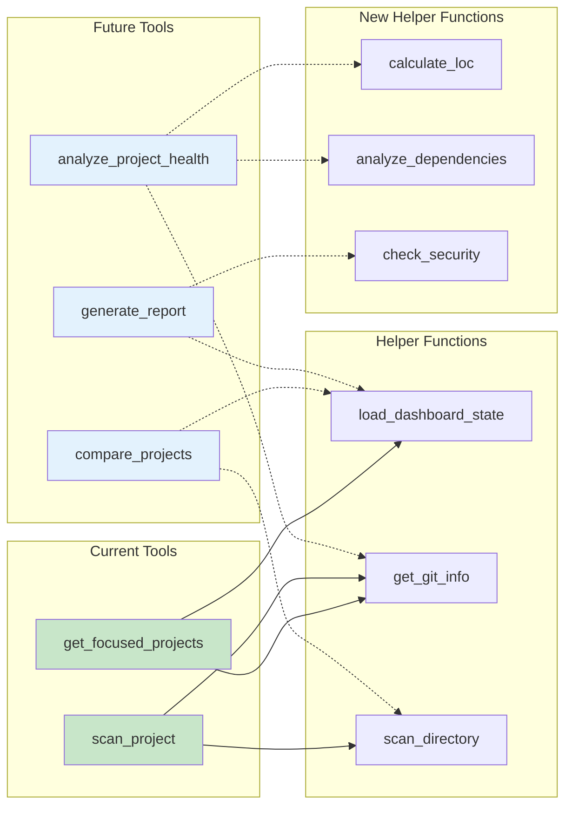

# Project Dashboard MCP Server v2 - 架構圖

## 系統架構圖

## 資料流程圖

## 元數據分類架構

## 工具處理流程

## 目錄掃描演算法

## Git 資訊提取流程

## 錯誤處理架構

## 擴展點架構

---

這些圖表展示了 Project Dashboard MCP Server v2 的完整架構設計，包括：

1. **系統架構**: 整體組件關係
2. **資料流程**: Tool 調用的完整流程
3. **元數據分類**: Declared vs Derived 的架構
4. **工具處理**: 詳細的處理邏輯
5. **掃描演算法**: 遞迴目錄掃描的實作
6. **Git 資訊**: 資訊提取的完整流程
7. **錯誤處理**: 完善的錯誤處理機制
8. **擴展點**: 未來可擴展的方向

你可以使用支援 Mermaid 的工具（如 GitHub, VS Code, Typora）來渲染這些圖表。
